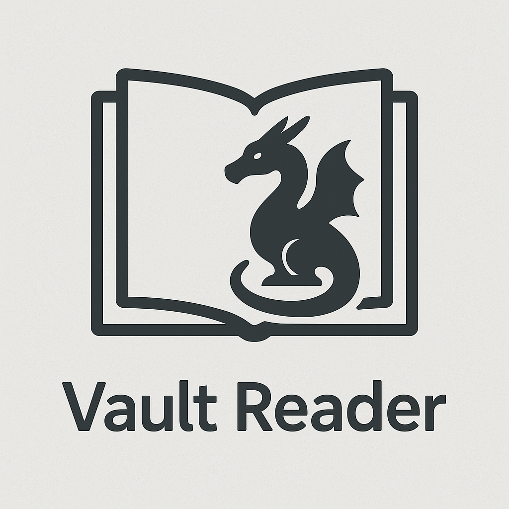

 

# Vault Reader (Under Development)

A minimal, modern, cross-platform synced e-book reader.

### Main Features

- Self Host with supabase
- Modern Minimal UI
- Cross platform sync
- Offline first
- Rich inbuilt, Note taking
- Inbuilt dictionary and web Search

### Screenshots

---

### [License](./LICENSE)

Vault Reader is licensed under the Apache License, Version 2.0.  
See the [LICENSE](./LICENSE) file for more details.
